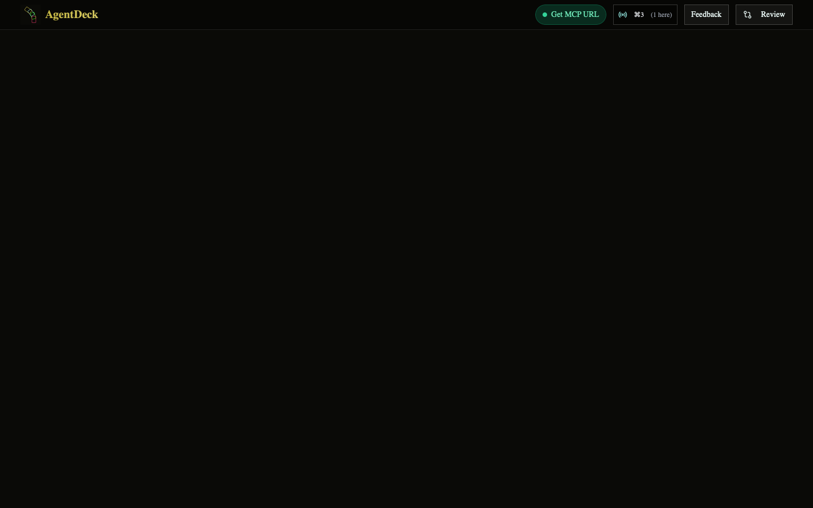
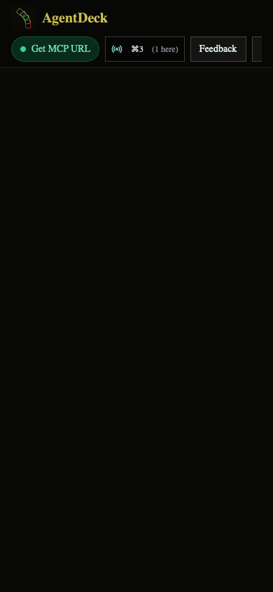

# NOT-256 visual QA — compact top bar rebalance (round 2)

Screenshots for the PR description. Both were rendered from a static
transcription of the `<header>` block in `apps/agent-deck/src/pages/home.tsx`
(final composition, including the `-my-1 py-1` focus-ring bleed room) with
`connectionStatus='connected'`, one live session, and zero open
feedback/review counts. CSS was compiled with the project's own
`apps/agent-deck/tailwind.config.ts`; body background `#0A0A07` matches the app.

Renderer: offscreen WebKit (legacy in-process `WebView` via `/tmp` tooling —
headless Chrome and `safaridriver` cannot spawn renderers in this sandbox).
Fonts fall back to system serif (no network for Nunito) and icon glyphs are
the fixture's transcription placeholders; layout geometry is unaffected.

## Measured geometry (from the live render, not class tokens)

Desktop 1440x900:

* Header is 53 px tall (36 px content + 16 px `py-2` + 1 px border).
* All four actions are 36 px tall with the same top offset (y=8):
  Get MCP URL (126 px), session trigger (114 px), Feedback (80 px),
  Review (101 px) — one shared vertical center line, no skew.
* Action row children share a single top offset — one row, no wrap;
  `scrollWidth == clientWidth`, so nothing overflows.

Narrow 390x844:

* Header is 97 px: brand row + action row, exactly two rows.
* All four actions are 36 px tall with the same top offset (y=52) —
  single-line action row, no third-row wrap.
* Action row `scrollWidth` (444) > `clientWidth` (358): the row is
  horizontally scrollable, so Review (partially past the right edge in the
  static shot) stays reachable without wrapping or label shrinkage.

## Review verdict

* Desktop: one level row, one-line brand (logo + AgentDeck, tagline
  screen-reader-only), equal-height actions — pass.
* Narrow: exactly brand row + scrollable action row, no clipping of labels,
  no overlap, no wrap — pass.
